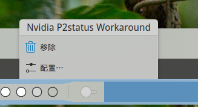

## `Nvidia GPU CUDA Force P2 Status` Workaround Widget
> simple widget for KDE, add a switch that can toggle between default:   
> `$ pkexec sh -c "nvidia-smi -rgc & nvidia-smi -rmc"`   
> and lower clock:   
> `$ pkexec sh -c "nvidia-smi -lgc 210,600 & nvidia-smi -lmc 405,810"`   
> workaround for [this issue](https://github.com/elFarto/nvidia-vaapi-driver/issues/74)


## Install
```bash
$ git clone https://github.com/detiam/nvidiap2statusworkaround.git
$ cd nvidiap2statusworkaround
$ kpackagetool5 --install package
# or upgrade:
$ kpackagetool5 --upgrade package
# and add this widget to any panel.
```